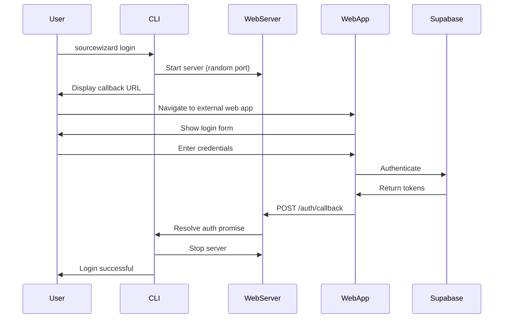

# Web-Based Authentication for CLI

## Overview

This document describes the implementation of web-based authentication for the SourceWizard CLI tool, providing a callback-based authentication flow that integrates with external web applications.

## Problem Statement

Traditional CLI authentication methods have several limitations:

1. **Security**: Plain text password entry in terminal history
2. **User Experience**: No visual feedback or modern UI elements
3. **Flexibility**: No support for OAuth providers or 2FA
4. **Integration**: Difficult to integrate with existing web applications

## Solution Architecture

### Components

1. **Web Authentication Module** (`src/shared/cli-web-auth/`)

   - Lightweight Express.js server on random localhost port
   - Provides callback endpoint for authentication token exchange
   - No web page serving - assumes external web application
   - Complete authentication module with organized files:
     - `server.ts` - WebAuthServer class for callback handling
     - `auth.ts` - CLIAuth class for authentication logic
     - `types.ts` - TypeScript interfaces
     - `index.ts` - Module exports

2. **Updated CLI Commands** (`src/cli/index.ts`)
   - Web callback authentication as the only method
   - Custom login page URL support
   - Clean error handling without fallbacks
   - Imports authentication from consolidated cli-web-auth module

### Authentication Flow



### Key Changes from Previous Version

1. **Random Port**: Server starts on port 0 (OS-assigned random port)
2. **No Web Pages**: Server only provides callback endpoint
3. **External Integration**: Assumes external web application handles UI
4. **Per-Session Servers**: New server instance for each login attempt
5. **Dynamic URLs**: Callback URL determined at runtime

### Security Considerations

1. **Random Ports**: Reduces port conflicts and improves security
2. **Local Server**: Only binds to localhost interface
3. **Token Security**: Tokens transmitted over localhost only
4. **Server Lifecycle**: Server automatically stops after authentication
5. **Timeout Protection**: 5-minute timeout for authentication process
6. **Per-Session Isolation**: Each login gets its own server instance

### User Experience Features

1. **Dynamic Port Assignment**: No port conflicts
2. **Callback URL Display**: Clear instructions for integration
3. **CLI Fallback**: Automatic fallback to CLI login on web failure
4. **Force CLI Mode**: `--cli` flag for users who prefer terminal authentication
5. **External App Integration**: Works with any web application

## Implementation Details

### Web Server Setup

```typescript
export class WebAuthServer {
  private actualPort: number | null = null;

  async start(port: number = 0): Promise<number> {
    // Port 0 lets OS choose random available port
    this.server = this.app.listen(port, "localhost", () => {
      this.actualPort = this.server.address()?.port || port;
      resolve(this.actualPort);
    });
  }

  getCallbackUrl(): string | null {
    return `http://localhost:${this.actualPort}/auth/callback`;
  }
}
```

### CLI Integration

```typescript
async loginWithBrowser(): Promise<AuthStatus> {
  const webAuthServer = new WebAuthServer();

  // Start server on random port
  const port = await webAuthServer.start();
  const callbackUrl = webAuthServer.getCallbackUrl();

  console.log(`📡 Callback endpoint: ${callbackUrl}`);

  // Wait for authentication
  const tokens = await webAuthServer.waitForAuth();

  // Cleanup
  await webAuthServer.stop();
}
```

### Command Line Options

```bash
# Callback-based authentication (default)
sourcewizard login

# CLI-based login
sourcewizard login --cli

# CLI-based with credentials
sourcewizard login -e user@example.com -p password
```

### Integration with External Web Apps

External web applications should:

1. **Display the callback URL** to users during CLI login
2. **Authenticate users** using their preferred method (Supabase, OAuth, etc.)
3. **POST authentication data** to the callback URL upon successful login

Example callback request:

```javascript
fetch(callbackUrl, {
  method: "POST",
  headers: { "Content-Type": "application/json" },
  body: JSON.stringify({
    access_token: session.access_token,
    refresh_token: session.refresh_token,
    expires_at: session.expires_at,
    user: { id: user.id, email: user.email },
  }),
});
```

## Benefits

1. **Enhanced Security**: No password exposure in terminal
2. **Port Flexibility**: No conflicts with existing services
3. **Integration Ready**: Easy integration with existing web applications
4. **Stateless**: Each login session is independent
5. **Fallback**: CLI option still available for all scenarios

## Future Enhancements

1. **OAuth Integration**: Support for GitHub, Google, etc. via external web apps
2. **2FA Support**: Two-factor authentication flows
3. **Multiple Callbacks**: Support for multiple authentication providers
4. **Session Management**: Better token refresh handling
5. **Mobile Support**: QR code authentication for mobile devices

## Testing Strategy

### Unit Tests

- Web server startup/shutdown with random ports
- Token exchange functionality
- CLI command option parsing
- Authentication flow error handling

### Integration Tests

- End-to-end authentication flows
- Server cleanup on failures
- Fallback mechanisms
- Port assignment validation

### Manual Testing

- Cross-platform server startup
- Network connectivity issues
- Port availability validation
- External web app integration

## Deployment Considerations

1. **Port Availability**: System chooses available ports automatically
2. **Firewall**: May need localhost exception for random ports
3. **External Apps**: Web applications need callback URL integration
4. **Dependencies**: Ensure Express.js works on target platforms

## Token Management

### Automatic Token Refresh

The CLI now implements automatic token refresh to keep users logged in without manual intervention. This feature ensures users don't get logged out every hour due to access token expiration.

#### How It Works

1. **Token Storage Enhancement**: The `TokenStorage` class now accepts a Supabase auth client to perform refresh operations
2. **Proactive Refresh**: When `getTokens()` is called, it checks if tokens expire within 5 minutes and automatically refreshes them
3. **Seamless Integration**: Token refresh happens transparently during CLI startup via `CLIAuth.initialize()`
4. **Graceful Degradation**: If refresh fails (e.g., revoked refresh token), tokens are cleared and user needs to login again

#### Implementation Details

**TokenStorage Updates:**

- Constructor now accepts optional `SupabaseAuthClient` parameter
- New `refreshTokens()` method uses Supabase's `refreshSession()` API
- Enhanced `getTokens()` method with automatic refresh logic
- Refresh attempts when tokens expire within 5 minutes

**CLIAuth Updates:**

- Passes auth client to TokenStorage constructor
- Enhanced `initialize()` method with automatic session restoration
- Improved error handling for session restoration failures

**Key Features:**

- **Proactive Refresh**: Refreshes tokens before they expire (5-minute threshold)
- **Error Handling**: Gracefully handles refresh failures and network errors
- **Backwards Compatibility**: Works without auth client (no refresh, but doesn't break)
- **Secure Storage**: Maintains existing file permission restrictions (0o600)

#### User Experience

- Users remain logged in across CLI sessions without re-authentication
- No interruption to workflow due to token expiration
- Automatic session restoration on CLI startup
- Clear error messages when authentication is required

#### Testing

Comprehensive test coverage includes:

- Valid token scenarios (no refresh needed)
- Automatic refresh when tokens expire soon
- Failed refresh scenarios with token cleanup
- Network error handling
- Backwards compatibility without auth client

## Conclusion

The updated web-based authentication provides a flexible, secure, and integration-friendly approach to CLI authentication. By using random ports and callback-only architecture, it enables seamless integration with external web applications while maintaining security and reliability.
